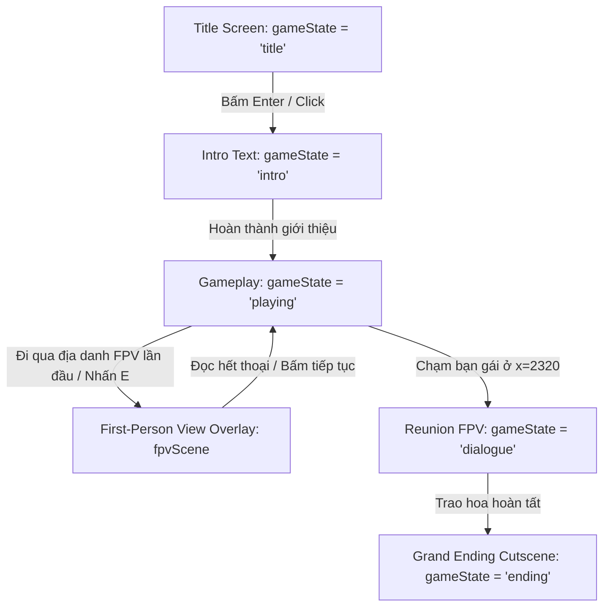

# 🗺️ Kiến Trúc Dự Án (Project Architecture)

## 1. Công Nghệ Cốt Lõi (Tech Stack)
- **Framework**: Next.js 16.1.6 (App Router) với **Turbopack** làm trình biên dịch và bundler.
- **Ngôn ngữ**: TypeScript 5, React 19 (hỗ trợ React Compiler / manual memoization).
- **Styling**: Tailwind CSS v4 kết hợp Vanilla CSS keyframes và CSS Variables.
- **Phong cách nghệ thuật**: Retro 2D Pixel Art chuẩn bảng màu **DawnBringer DB32**.
- **Kích thước khung hình (Canvas)**: $600 \times 400$ px (kèm viền letterbox điện ảnh $20$ px trên/dưới trong các phân cảnh FPV và Ending).

---

## 2. Cấu Trúc Thư Mục
```
met-web/
├── .agents/
│   └── rules/
│       └── ki-update-rule.md       # Quy tắc bắt buộc cập nhật KI sau mỗi phiên
├── knowledge/                     # Trung tâm tri thức (KI) của dự án
│   ├── README.md                  # Mục lục chính
│   ├── architecture.md            # Tài liệu kiến trúc này
│   ├── gameplay-mechanics.md      # Cơ chế game, vật lý, điều khiển
│   ├── visual-assets.md           # Đồ họa pixel, bảng màu, script sinh ảnh
│   ├── troubleshooting-and-learnings.md # Lỗi kỹ thuật & đúc kết kinh nghiệm
│   └── session-memory.md          # Nhật ký ký ức phiên làm việc
├── public/
│   └── assets/
│       ├── character/             # Sprite nhân vật chính (idle, walk, bouquet...)
│       ├── decorations/           # Hoa nhỏ, bụi cỏ, bướm
│       ├── others/                # FPV pixel art (mèo, ô, đèn, cầu, hoa, thiệp...)
│       └── sounds/                # Hiệu ứng âm thanh Web Audio (nhảy, hoa, mèo, mưa...)
├── scripts/
│   ├── generate-hd-fpv-all.js     # Script sinh pixel art chất lượng cao cho FPV
│   └── generate-character-sprites.js # Script sinh spritesheets nhân vật
├── src/
│   ├── app/
│   │   ├── globals.css            # Keyframe animations, phong cách pixelated
│   │   ├── layout.tsx             # Root layout, Google Font VT323 pixel font
│   │   └── page.tsx               # Trang chính chứa <Game />
│   ├── components/
│   │   ├── canvas.tsx             # Khung Canvas 600x400 cố định
│   │   ├── game.tsx               # Game Manager trung tâm điều phối trạng thái
│   │   ├── hero.tsx               # Component nhân vật chính, physics loop, input
│   │   ├── first-person-view.tsx  # Cảnh góc nhìn thứ nhất (Cat, Rain, Lamp, Bridge, Cherry)
│   │   ├── fpv-rain-effect.tsx    # Hệ thống hạt mưa chân thực cho cảnh FPV Rain
│   │   ├── thought-bubble.tsx     # Khung suy nghĩ khi nhặt hoa, tự đóng theo khoảng cách
│   │   ├── props-layer.tsx        # Cảnh vật tương tác (xích đu, biển chỉ dẫn, mèo, đèn...)
│   │   ├── ending-cutscene.tsx    # Đại kết cục (pháo hoa, cánh hoa rơi, thiệp "I LOVE U")
│   │   └── admin-panel.tsx        # Bảng điều khiển debug (~ hoặc F2)
│   ├── hooks/
│   │   ├── use-game-loop.ts       # Vòng lặp game chuẩn 60fps qua requestAnimationFrame
│   │   └── use-keyboard.ts        # Hook xử lý bàn phím kèm cơ chế resetKeys
│   └── lib/
│       ├── level-data.ts          # Dữ liệu màn chơi: tọa độ 7 hoa, props, story milestones
│       ├── physics.ts             # Thuật toán va chạm AABB, kiểm tra mặt đất
│       └── sound.ts               # Bộ phát âm thanh tự tạo (Web Audio API Synthesizer)
```

---

## 3. Máy Trạng Thái Cốt Lõi (Game State Machine)

Trạng thái toàn cục được điều phối tại [src/components/game.tsx](file:///c:/Users/Tran%20Gia%20Thieu/.gemini/antigravity-ide/scratch/met-web/src/components/game.tsx):



---

## 4. Các Hooks Quan Trọng

### 4.1. `useGameLoop(callback, active)`
- Chạy dựa trên `requestAnimationFrame` với độ lệch thời gian `dt = Math.min((now - lastTime) / 16.67, 2.0)` để đảm bảo vật lý mượt mà và không bị giật lag nếu tụt frame.
- Tự động dừng khi `active = false` (ví dụ khi đang ở màn hình Title hoặc Cutscene).

### 4.2. `useKeyboard(active)`
- Quản lý trạng thái phím ấn qua `pressedKeys.current`.
- **Điểm mấu chốt**: Tích hợp danh sách `mustReleaseKeys`. Khi kích hoạt `resetKeys()`, mọi phím đang được giữ sẽ bị đánh dấu là "phải nhả". Khi người chơi chưa thả phím vật lý ra (`keyup`), mọi sự kiện auto-repeat của hệ điều hành sẽ bị vô hiệu hóa hoàn toàn.

---

## 5. Hệ Thống Âm Thanh Tổng Hợp (Web Audio SFX & Adaptive BGM)
- Toàn bộ âm thanh trong [src/lib/sound.ts](file:///c:/Users/Tran%20Gia%20Thieu/.gemini/antigravity-ide/scratch/met-web/src/lib/sound.ts) được sinh trực tiếp bằng trình tạo dao động âm thanh (`OscillatorNode`, `GainNode`, `AudioContext`) không cần phụ thuộc vào file MP3 bên ngoài:
  - **SFX Cơ Bản**:
    - `SFX.jump()`: Âm thanh nhảy 8-bit nhẹ nhàng.
    - `SFX.harpChime()`: Hợp âm rải đàn hạc ngân vang khi nhặt hoa.
    - `SFX.catPurr()`: Tiếng mèo gừ gừ ấm áp tần số thấp kèm rung nhịp thở.
    - `SFX.catMeowShort()`: Tiếng mèo kêu vui sướng `mew` khi đạt tim tối đa.
    - `SFX.umbrellaOpen()`: Tiếng mở ô lách cách khi vào vùng mưa.
    - `SFX.umbrellaTap()`: Tiếng giọt mưa rớt lộp độp trên tán ô khi nghiêng chắn gió.
    - `SFX.lampClick()`: Tiếng công tắc bật đèn đường.
    - `SFX.puddleStep()`: Tiếng chân dẫm nước lép bép khi chạy qua vũng mưa.
    - `SFX.swingWhoosh()`: Tiếng gió vút nhẹ theo chu kỳ đưa con lắc của xích đu.
    - `SFX.flowerBloom()`: Tiếng hoa e ấp bung nở khi tiến lại gần.
    - `SFX.allCollected()`: Chuỗi hợp âm vinh quang khi thu thập đủ 7 bông hoa.
  - **Adaptive BGM Synthesizer (`BGMController`)**:
    - Thiết kế Chiptune Lo-Fi 70 BPM với 4 tầng nhạc cụ thích ứng tự động bật tắt theo tiến trình thu thập hoa:
      1. **Stem 1 (Breeze / Ambience)**: Tiếng gió thì thào mô phỏng bằng filtered noise (bật từ đầu).
      2. **Stem 2 (Lo-Fi Piano Chords)**: Hợp âm rải vòng `Fmaj7 - G6 - Em7 - Am7` tạo cảm giác hoài niệm (kích hoạt từ bông hoa #1).
      3. **Stem 3 (Cello Bass)**: Nốt trầm ấm áp nâng đỡ cảm xúc hoặc tiếng mưa rào bổ trợ (kích hoạt từ bông hoa #3 hoặc khi vào vùng mưa).
      4. **Stem 4 (Glockenspiel Chimes)**: Giai điệu chuông trong trẻo lấp lánh (kích hoạt khi thu thập $\ge 5$ bông hoa).
    - Bộ lập lịch Lookahead (`lookahead = 150ms`, chu kỳ tick `25ms`) đảm bảo nhịp điệu chính xác tuyệt đối, không bị lệch pha hay giật cục trên trình duyệt.
    - Chuyển âm lượng mượt mà bằng `linearRampToValueAtTime` (thời gian chuyển 1.5s).

---

## 6. Các Thành Phần Tương Tác & Cơ Chế Thế Giới Mở Rộng
- **`Hero` (`src/components/hero.tsx`)**:
  - Tích hợp trạng thái ngồi thư giãn (`isSitting`) trên ghế đá và đung đưa xích đu (`isSwinging`).
  - Sử dụng bộ 6 sprite toàn thân tích hợp cầm ô (`hero-umbrella-*.png`, $64 \times 84\text{ px}$) căn chỉnh mốc sàn `pos.y - 36px` để loại bỏ hoàn toàn lỗi ô bay lơ lửng.
  - Va chạm sàn trên cao dạng one-way qua `resolveVerticalPlatformCollision` cho tảng đá bám rêu (bông hoa #6).
  - Tự động phát hiện vũng nước khi chân chạm sàn để kích hoạt hiệu ứng nước bắn và âm thanh `puddleStep`.
- **`PropsLayer` (`src/components/props-layer.tsx`)**:
  - Ghế đá công viên tiếp đất vững chãi tại $x = 450, y = 284$ với mèo tam thể cuộn tròn ngủ ngoan.
  - Xích đu gỗ khung chữ A cắm sát mặt đất $y = 320$ tại $x = 680, y = 240$, dao động theo hàm con lắc đơn $\sin(t)$.
  - Cột đèn đường tự động phát nón ánh sáng vàng dịu khi trời tối ($x \ge 1050$).
  - Cây cầu gỗ đêm sao với vầng trăng rọi bóng suối ($x = 1500$).
- **`LetterFragment` (`src/components/letter-fragment.tsx`)**:
  - 3 mảnh thư giấy kraft viền vẽ tay doodle matching `message.png`.
  - Mảnh 3 tại bìa rừng trang bị hào quang vàng phát sáng (visual beacon pulse) và nhãn `✨ Mảnh Thư #3 [E]`, hỗ trợ nhặt trực tiếp bằng `[E]` hoặc va chạm bước qua.
- **`FpvLetterCrafting` (`src/components/fpv-letter-crafting.tsx`)**:
  - Mini-game xếp hình dán thư hoa anh đào trực quan tại bàn đá đỉnh đồi ($x = 2210$), dán 2 dải băng keo Washi hoàn thiện chính tấm thiệp `message.png`.
- **`FirstPersonView` (`src/components/first-person-view.tsx`)**:
  - Cảnh Mèo Doodle (`fpv-cat-doodle.png`): Tranh vẽ tay sáp màu ấm áp, thở theo chu kỳ sin, click vuốt ve sinh tim hồng và rung rừ rừ.
  - Tương tác che ô: Điều khiển góc nghiêng để hứng giọt mưa tạt, có tiếng lộp độp và giọt bắn.
  - Tương tác sưởi tay: Bấm giữ sưởi ấm dưới bóng đèn, bốc khói ấm và làm đóa hoa hồng phát sáng.
- **`Collectible` (`src/components/collectible.tsx`)**:
  - 7 cơ chế xuất hiện và tương tác hoa hồng riêng biệt: Nở khi đến gần, Mèo trao tặng, Rơi trong mưa, Đèn soi sáng, Đom đóm vây quanh trên cầu, Nhảy lên tảng đá cao, Vòng hào quang bình minh.


